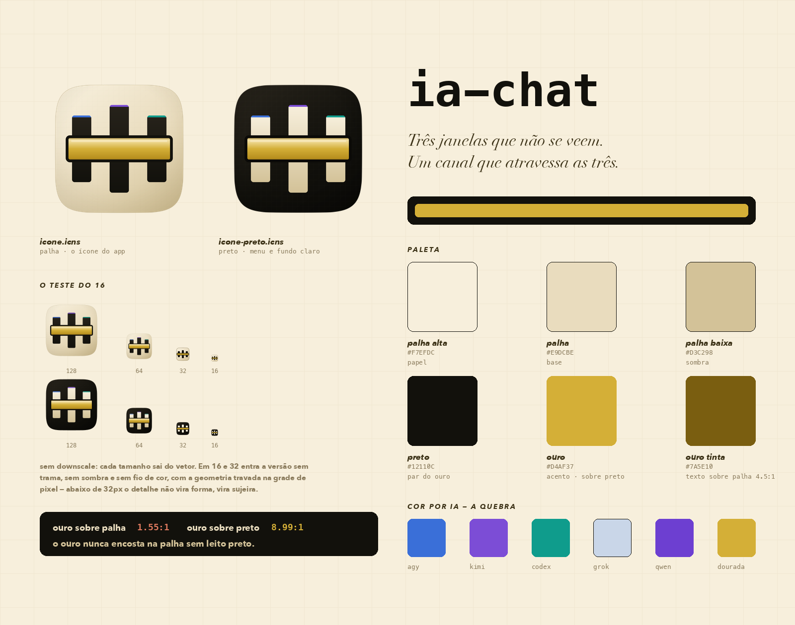

# Marca — `ia-chat`



## O conceito, em cinco linhas

O `ia-chat` é a sala onde IAs que não veem o contexto uma da outra se ajudam.
O símbolo é isso e nada mais: **três janelas verticais que não se tocam** — cada IA
fechada na sua sessão, cega às outras — e **um único canal horizontal que atravessa
as três** e ainda passa além delas, porque o canal está aberto para quem chegar.
A separação é desenhada como vazio; o encontro é desenhado como ouro.

Não é um balão de chat. Balão diz "conversa"; este símbolo diz **o que torna a
conversa possível** entre janelas cegas — que é o produto.

## O símbolo, elemento por elemento

| elemento | o que é | o que significa |
|---|---|---|
| 3 hastes verticais | mesma largura, alturas simétricas (a do meio mais alta) | as IAs, cada uma na sua janela |
| o vão entre elas | vale quase o mesmo que a haste | a cegueira mútua — é estrutural, não sobra de layout |
| a barra dourada | atravessa as três e projeta 32 u além | o canal comum: o `ia-chat` |
| o leito preto do canal | contorno de 18 u ao redor do ouro | o preto que faz o ouro existir (ver a regra abaixo) |
| fio de cor no topo | 12 u, uma cor por haste | a cor por IA, como quebra — some abaixo de 64px, de propósito |
| trama de 34 u | linhas a 5% de opacidade | as "camadinhas por cima": textura que premia o olhar de perto |

Corpo na grade Big Sur (arte de 824 em canvas de 1024) e canto em **superelipse
n=5**, não em round-rect — o canto contínuo é a diferença entre ícone de app e
ícone amador no Dock.

## Paleta

| token | hex | papel |
|---|---|---|
| `palha-alta` | `#F7EFDC` | papel, superfície de cima |
| `palha` | `#E9DCBE` | **a base** |
| `palha-baixa` | `#D3C298` | sombra, borda, estado recuado |
| `preto` | `#12110C` | o par do ouro, texto, marca |
| `preto-alto` | `#26221A` | elevação sobre preto |
| `ouro` | `#D4AF37` | **o acento** — superfície, sempre sobre preto |
| `ouro-tinta` | `#7A5E10` | ouro como **texto sobre palha** (4.50:1, AA) |

## Onde o dourado entra como ênfase — e a regra que o número impôs

Medido em contraste WCAG:

```
ouro #D4AF37 sobre palha #E9DCBE ....... 1.55:1     invisível
ouro #D4AF37 sobre preto #12110C ....... 8.99:1     canta
preto #12110C sobre palha #E9DCBE ..... 13.90:1
palha #F7EFDC sobre preto #12110C ..... 16.50:1
ouro-tinta #7A5E10 sobre palha ......... 4.50:1     AA para texto
```

Daí a única regra inegociável da marca:

> **O ouro nunca encosta na palha sem leito preto.**

Ele intuiu isso ao pedir "preto + dourado como par principal". O número explica por
quê: sobre palha o ouro tem 1,55:1 — some. As três formas de usar ênfase dourada:

1. **Superfície dourada** (barra, selo, badge, borda ativa): sempre sobre preto, ou
   com contorno preto próprio. É assim que o canal do ícone funciona.
2. **Palavra em ouro dentro do chat**: o texto vai em `ouro-tinta` `#7A5E10`
   (4.50:1 sobre palha) — não em `ouro`.
3. **Grifo invertido**: a palavra em `ouro` `#D4AF37` sobre um leito preto de cantos
   arredondados. É o realce mais forte da casa; usar com parcimônia, porque ele para o olho.

Estado tem cor semântica própria e **não** usa ouro — ouro significa ênfase e marca,
nunca "sucesso" ou "erro". Se ouro virar cor de estado, deixa de ser marca.

## Cor por IA — a quebra da paleta

`agy` `#3A6FD8` · `kimi` `#7C4DD6` · `codex` `#0F9C8C` · `grok` `#C9D6E8` ·
`qwen` `#6D3FD1` · `dourada` `#D4AF37`

Tons de joia, não de post-it: dessaturados o suficiente para não competir com o ouro.
No ícone entram só três, como fio de 12 u no topo das hastes — detalhe que
desaparece abaixo de 64px. **Seis cores não cabem em 16 pixels**; forçá-las seria
trocar legibilidade por completude. A cor por IA vive na interface (presença, borda
de mensagem, avatar), onde há espaço para ela significar algo.

## O teste do 16×16 — honesto

O 16 foi o critério de projeto, não a verificação final. A geometria do modo pequeno
é toda múltipla de 64 u (= 1px em 16px), então a marca cai em pixel inteiro em vez de
virar cinza no antialiasing; e em 16/32 entram versões **sem** trama, sombra, brilho e
fio de cor — abaixo de 32px esse detalhe não vira forma, vira sujeira.

| | 16px | veredito |
|---|---|---|
| **preto** | três janelas claras nítidas, fio dourado separado | **lê bem.** É a versão que recomendo para menu, favicon e fundo claro |
| **palha** | a estrutura lê (3 hastes + canal); o ouro fica próximo do bege | **lê, com ressalva** — em 16px a identidade vem da forma, não da cor |

Prova em `render/prova-16.png` (ampliado com NEAREST: o pixel real, sem suavizar) e
`render/prova-real.png` (1:1, como o Finder mostra).

Nenhum PNG é redução de outro: cada tamanho sai do vetor.

## Arquivos

| arquivo | o que é |
|---|---|
| `icone.svg` | **o mestre**, 1024, tema palha |
| `icone-preto.svg` | variante preta (menu, favicon, fundo claro) |
| `icone-pequeno.svg` · `icone-preto-pequeno.svg` | a versão hintada de 16/32 |
| `icone.icns` · `icone-preto.icns` | montados com `iconutil -c icns`, 10 representações de 16 a 1024 |
| `marca.png` | a prancha de apresentação (para o README) |
| `render/` | PNGs por tamanho e as folhas de prova |
| `gerar_icone.py` · `prancha.py` · `prova_16.py` | regeneram tudo |

```bash
python3 gerar_icone.py          # SVGs + PNGs + os dois .icns
python3 prova_16.py             # as folhas de prova
python3 prancha.py              # marca.png
```

O SVG não usa `<filter>` — só paths, gradientes e patterns. Foi conferido:
renderizado no Chrome e no cairosvg, a diferença média é **0,31/255**, e só em bordas
antialiasadas. Isso significa que ele sai igual no Finder, no navegador, no Preview e
em qualquer outro consumidor — nenhum efeito depende de um motor específico.
